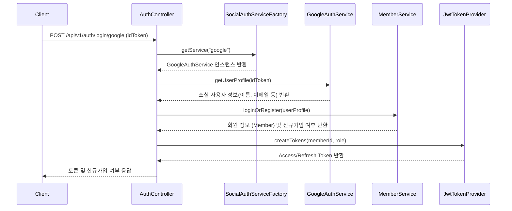

# 🧩 도메인 상세: 인증/회원 (Auth/Member)

이 문서는 `auth` 도메인의 책임, 주요 비즈니스 로직, 클래스 구조, 그리고 다른 도메인과의 상호작용을 상세히 설명합니다.

-   **패키지 경로**: `com.orv.api.domain.auth`

---

### 1. 도메인 책임 (Responsibilities)

-   **소셜 로그인 처리**: Google, Kakao 등 외부 소셜 플랫폼을 통한 사용자 인증 및 회원가입을 처리합니다.
-   **JWT 기반 인증/인가**: 서비스의 자체적인 인증 토큰(Access Token, Refresh Token)을 발급, 검증, 재발급합니다. Spring Security와 연동하여 API 접근 제어를 수행합니다.
-   **회원 정보 관리**: 사용자의 프로필 정보 조회 및 회원 탈퇴 기능을 제공합니다.

---

### 2. 주요 비즈니스 로직 및 흐름

#### **소셜 로그인 흐름**

1.  **`AuthController`**: 클라이언트로부터 소셜 ID 토큰을 받습니다.
2.  **`SocialAuthServiceFactory`**: `provider` 값(google, kakao)에 따라 적절한 `SocialAuthService` 구현체(예: `GoogleAuthService`)를 반환합니다.
3.  **`GoogleAuthService`**: Google의 공개 키를 사용하여 ID 토큰을 검증하고, 유효하다면 사용자의 프로필 정보를 추출합니다.
4.  **`MemberService`**: 추출된 이메일과 provider 정보로 기존 회원을 조회하거나, 없다면 새로 가입시킵니다.
5.  **`JwtTokenProvider`**: `Member`의 ID와 역할을 기반으로 서비스에서 사용할 JWT Access/Refresh Token을 생성합니다.

---

### 3. 주요 클래스 및 역할

-   **`AuthController`**: `/api/v1/auth` 경로의 엔드포인트를 담당합니다. `SocialAuthServiceFactory`와 `MemberService`를 사용하여 로그인/회원가입 로직을 오케스트레이션합니다.
-   **`MemberController`**: `/api/v1/members` 경로의 엔드포인트를 담당합니다. 내 정보 조회, 회원 탈퇴 등 로그인된 사용자와 관련된 기능을 처리합니다.
-   **`SocialAuthService` (Interface)**: 소셜 로그인 서비스의 규약(interface)입니다. `getUserProfile` 메소드를 정의합니다.
    -   **`GoogleAuthService`, `KakaoAuthService`**: `SocialAuthService`의 구현체로, 각 플랫폼의 인증 방식에 맞게 ID 토큰을 검증하고 사용자 정보를 가져옵니다.
-   **`MemberService`**: 회원 정보 조회, 생성, 수정, 삭제 등 회원과 관련된 핵심 비즈니스 로직을 처리합니다.
-   **`JdbcMemberRepository`**: JDBC를 사용하여 `MEMBER` 테이블과의 데이터베이스 상호작용을 담당합니다.
-   **`JwtTokenProvider`**: JWT 생성, 파싱, 유효성 검증을 담당하는 유틸리티 클래스입니다.
-   **`JwtAuthorizationFilter`**: Spring Security 필터 체인에 등록되어, 각 API 요청의 `Authorization` 헤더에서 JWT를 검증하고 인증 컨텍스트(`SecurityContext`)를 설정합니다.

---

### 4. 다른 도메인과의 관계

-   **`Reservation` 도메인**: 사용자가 예약을 생성할 때, 해당 사용자의 `member_id`를 참조합니다.
-   **`Storyboard` 도메인**: 사용자가 스토리보드를 생성할 때, 해당 사용자의 `member_id`를 참조합니다.
-   **전역 (`Global`)**:
    -   `auth` 도메인은 전역적으로 사용되는 `ApiResponse` DTO를 사용하여 클라이언트에 응답합니다.
