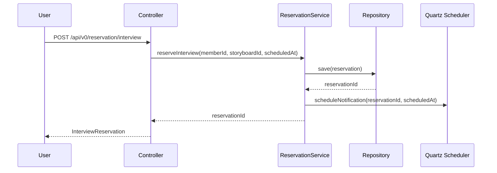
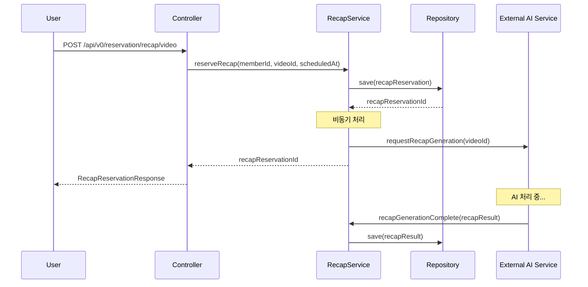

# 🧩 도메인 모델: 예약 (Reservation)

이 문서는 `reservation` 도메인의 핵심 비즈니스 로직, 주요 엔티티, 그리고 다른 도메인과의 관계를 설명합니다.

---

## 1. 도메인 개요

### 1.1 책임 (Responsibility)
- **인터뷰 예약**: 사용자가 특정 스토리보드에 대한 인터뷰를 예약하고 관리
- **리캡 예약**: 사용자가 영상에 대한 리캡 생성을 예약하고 관리
- **예약 상태 관리**: 예약의 생명주기 관리 (생성, 진행, 완료)
- **알림 스케줄링**: 예약 관련 알림 메시지 스케줄링

### 1.2 핵심 패키지 구조
```
com.orv.api.domain.reservation/
├── ReservationController.java          # HTTP 요청 처리
├── ReservationService.java             # 인터뷰 예약 비즈니스 로직 인터페이스
├── ReservationServiceImpl.java         # 인터뷰 예약 비즈니스 로직 구현
├── RecapService.java                   # 리캡 예약 비즈니스 로직 인터페이스
├── RecapServiceImpl.java               # 리캡 예약 비즈니스 로직 구현
├── ReservationRepository.java          # 예약 데이터 접근 인터페이스
├── JdbcReservationRepository.java      # 예약 데이터 접근 구현
├── RecapRepository.java                # 리캡 데이터 접근 인터페이스
├── JdbcRecapRepositoryImpl.java        # 리캡 데이터 접근 구현
├── ReservationNotificationService.java # 예약 알림 서비스
├── dto/                                # 데이터 전송 객체
└── jobs/                               # 스케줄링 작업
```

---

## 2. 핵심 엔티티 (Core Entities)

### 2.1 InterviewReservation
**인터뷰 예약 정보를 나타내는 도메인 객체**

```java
public class InterviewReservation {
    private UUID id;              // 예약 고유 ID
    private UUID memberId;        // 예약한 회원 ID
    private UUID storyboardId;    // 인터뷰 대상 스토리보드 ID
    private LocalDateTime scheduledAt;  // 예약 예정 시각
    private LocalDateTime createdAt;    // 예약 생성 시각
}
```

**주요 특징:**
- 회원(`Member`)과 스토리보드(`Storyboard`) 간의 연결점 역할
- 예약 시간 정보를 통한 스케줄링 기능 제공
- 예약 상태 추적 및 관리

### 2.2 RecapReservation
**리캡 생성 예약 정보를 나타내는 도메인 객체**

```java
public class RecapReservationResponse {
    private UUID id;              // 리캡 예약 고유 ID
    private UUID memberId;        // 예약한 회원 ID
    private UUID videoId;         // 리캡 대상 영상 ID
    private LocalDateTime scheduledAt;  // 예약 예정 시각
    private LocalDateTime createdAt;    // 예약 생성 시각
}
```

### 2.3 RecapResult
**리캡 생성 결과를 나타내는 도메인 객체**

```java
public class RecapResultResponse {
    private UUID recapResultId;     // 리캡 결과 고유 ID
    private OffsetDateTime createdAt;  // 결과 생성 시각
    private List<RecapAnswerSummaryResponse> answerSummaries;  // 답변 요약 목록
}
```

### 2.4 RecapAnswerSummary
**리캡 내 개별 답변 요약 정보**

```java
public class RecapAnswerSummaryResponse {
    private UUID sceneId;         // 관련 씬 ID
    private String question;      // 질문 내용
    private String answerSummary; // 답변 요약
}
```

---

## 3. 주요 유스케이스 (Use Cases)

### 3.1 인터뷰 예약 관리

#### 3.1.1 인터뷰 예약 생성
```java
// ReservationService.java
Optional<UUID> reserveInterview(UUID memberId, UUID storyboardId, OffsetDateTime reservedAt);
Optional<UUID> reserveInstantInterview(UUID memberId, UUID storyboardId);
```

**비즈니스 로직:**
1. 사용자가 특정 스토리보드에 대한 인터뷰를 예약
2. 즉시 시작 옵션 제공 (`reserveInstantInterview`)
3. 예약 정보를 데이터베이스에 저장
4. 알림 스케줄 등록

#### 3.1.2 인터뷰 예약 조회
```java
// ReservationService.java
Optional<InterviewReservation> getInterviewReservationById(UUID reservationId);
Optional<List<InterviewReservation>> getForwardInterviews(UUID memberId, OffsetDateTime from);
```

**비즈니스 로직:**
1. 개별 예약 조회
2. 특정 회원의 향후 예약 목록 조회
3. 시간 기준 필터링 지원

#### 3.1.3 인터뷰 완료 처리
```java
// ReservationService.java
boolean markInterviewAsDone(UUID interviewId);
```

**비즈니스 로직:**
1. 진행 중인 인터뷰를 완료 상태로 변경
2. 상태 업데이트 및 후속 처리

### 3.2 리캡 예약 관리

#### 3.2.1 리캡 예약 생성
```java
// RecapService.java
Optional<UUID> reserveRecap(UUID memberId, UUID videoId, ZonedDateTime scheduledAt);
```

**비즈니스 로직 (상세):**
1. **예약 정보 DB 저장** - `recap_reservation` 테이블에 예약 정보 저장
2. **영상 스트림 다운로드** - VideoRepository에서 영상 스트림 획득, 임시 파일 생성
3. **오디오 추출** - AudioExtractService를 통해 MP4 → WAV 변환
4. **오디오 압축** - AudioCompressionService를 통해 WAV → Opus 압축
5. **S3 업로드** - AudioRepository를 통해 압축된 오디오 S3 저장
6. **메타데이터 저장** - InterviewAudioRecording 객체 생성 및 DB 저장
7. **스토리보드 정보 조회** - 인터뷰 시나리오 생성을 위한 스토리보드/씬 정보 조회
8. **외부 AI 서버 호출** - RecapClient를 통해 오디오 + 시나리오 전송
9. **결과 저장** - AI 서버 응답을 RecapResult 및 RecapAnswerSummary로 저장
10. **리소스 정리** - 임시 파일 안전 삭제

**기술적 특징:**
- 임시 파일 안전 관리 (try-finally 블록)
- 오디오 포맷 최적화 (Opus 고효율 압축)
- 단계별 상세 로깅 및 에러 처리
- 외부 서비스 연동 안정성 확보

#### 3.2.2 리캡 결과 조회
```java
// RecapService.java
Optional<RecapResultResponse> getRecapResult(UUID recapReservationId);
```

**비즈니스 로직:**
1. 완료된 리캡 결과 조회
2. 씬별 질문-답변 요약 정보 제공
3. AI 생성 답변 요약과 원본 질문 매핑
4. 생성 시간 및 메타데이터 포함

**데이터 구조:**
- `RecapResultResponse`: 전체 리캡 결과 래퍼
- `RecapAnswerSummaryResponse[]`: 씬별 답변 요약 배열
- 각 요약은 sceneId, question, answerSummary 포함

---

## 4. 도메인 간 관계 (Domain Relationships)

### 4.1 의존하는 도메인
- **`auth`**: 사용자 인증 및 회원 정보 (`memberId` 참조)
- **`storyboard`**: 인터뷰 대상 스토리보드 정보 (`storyboardId` 참조)
- **`media`**: 영상 파일 정보 (`videoId` 참조)

### 4.2 의존되는 도메인
- **`admin`**: 관리자에 의한 예약 관리
- **`archive`**: 완료된 인터뷰 아카이빙

### 4.3 외부 시스템 연동
- **Quartz Scheduler**: 예약 알림 및 작업 스케줄링
- **Recap AI Server**: 리캡 생성 요청 및 결과 처리
- **알림 시스템**: 예약 관련 알림 메시지 발송

---

## 5. 핵심 비즈니스 규칙

### 5.1 인터뷰 예약 규칙
1. **중복 예약 방지**: 동일 회원이 동일 스토리보드에 대해 중복 예약 불가
2. **시간 검증**: 과거 시간으로 예약 불가
3. **즉시 시작**: `startNow=true` 파라미터로 즉시 인터뷰 시작 가능
4. **상태 관리**: 예약 → 진행 중 → 완료 상태 전환

### 5.2 리캡 예약 규칙
1. **영상 존재 확인**: 리캡 대상 영상이 존재해야 함
2. **중복 처리 방지**: 동일 영상에 대한 중복 리캡 생성 방지
3. **비동기 처리**: 리캡 생성은 비동기로 처리
4. **결과 저장**: 생성된 리캡 결과는 영구 저장

### 5.3 알림 규칙
1. **예약 확인**: 예약 생성 시 확인 알림 발송
2. **사전 알림**: 예약 시간 전 미리 알림 발송
3. **시간 도달**: 예약 시간 도달 시 알림 발송

---

## 6. 데이터 플로우

### 6.1 인터뷰 예약 플로우


### 6.2 리캡 예약 플로우


---

## 7. 기술적 고려사항

### 7.1 성능 최적화
- **비동기 처리**: 리캡 생성은 외부 AI 서비스 연동으로 인한 긴 처리 시간 대응
- **인덱스 활용**: 회원별, 시간별 조회 성능 향상을 위한 데이터베이스 인덱스
- **배치 처리**: 대량 알림 발송을 위한 배치 처리 구현

### 7.2 안정성 확보
- **재시도 로직**: 외부 서비스 호출 실패 시 재시도 메커니즘
- **트랜잭션 관리**: 예약 생성 및 상태 변경 시 데이터 일관성 보장
- **예외 처리**: 다양한 예외 상황에 대한 적절한 처리

### 7.3 모니터링
- **예약 상태 추적**: 예약 생성부터 완료까지의 전체 생명주기 모니터링
- **알림 발송 모니터링**: 알림 발송 성공/실패 추적
- **외부 서비스 연동 모니터링**: AI 서비스 응답 시간 및 성공률 추적

---

## 8. 확장 가능성

### 8.1 추가 예약 유형
- **그룹 인터뷰**: 다중 참여자 인터뷰 예약
- **라이브 스트리밍**: 실시간 스트리밍 예약
- **배치 처리**: 대량 영상 일괄 처리 예약

### 8.2 고급 기능
- **지능형 스케줄링**: AI 기반 최적 시간 추천
- **자동 리마인더**: 사용자 행동 패턴 기반 알림
- **예약 분석**: 예약 패턴 분석 및 인사이트 제공

---

## 9. 테스트 전략

### 9.1 단위 테스트
- 각 Service 메서드별 단위 테스트
- 비즈니스 로직 검증
- 예외 상황 처리 테스트

### 9.2 통합 테스트
- 외부 서비스 연동 테스트
- 데이터베이스 트랜잭션 테스트
- 스케줄링 기능 테스트

### 9.3 성능 테스트
- 동시 예약 처리 성능 테스트
- 대량 알림 발송 성능 테스트
- 리캡 생성 처리량 테스트
