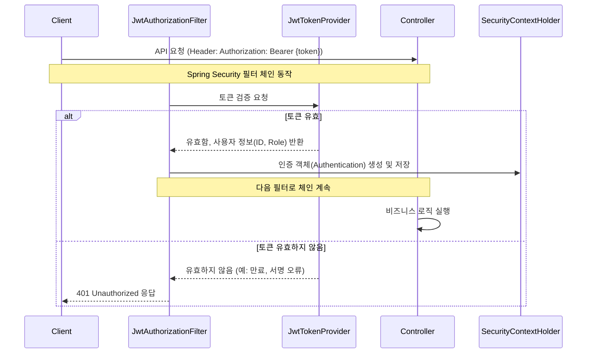

# 💡 핵심 개념: 인증/인가 흐름 (Authentication & Authorization)

이 문서는 `orv-api-server`의 JWT 기반 인증 및 인가 흐름을 Spring Security와 연관 지어 상세하게 설명합니다.

---

### 1. 전체 흐름 다이어그램

---

### 2. 주요 컴포넌트와 역할

#### **`SecurityConfig`**

-   **역할**: Spring Security의 동작을 설정하는 핵심 설정 파일입니다.
-   **주요 설정 내용**:
    -   `http.csrf().disable()`: CSRF(Cross-Site Request Forgery) 보호를 비활성화합니다. (Stateless한 JWT 방식에서는 불필요)
    -   `http.sessionManagement().sessionCreationPolicy(SessionCreationPolicy.STATELESS)`: 세션을 사용하지 않는 Stateless 방식으로 설정합니다.
    -   `http.authorizeHttpRequests()`: URL 경로별로 접근 권한을 설정합니다.
        -   `/api/v1/auth/**`, `/h2-console/**` 등: 모든 사용자에게 허용 (`permitAll()`)
        -   `/api/v1/admin/**`: `ADMIN` 역할을 가진 사용자만 허용 (`hasRole("ADMIN")`)
        -   그 외 모든 요청: 인증된 사용자만 허용 (`anyRequest().authenticated()`)
    -   `http.addFilterBefore(jwtAuthorizationFilter, UsernamePasswordAuthenticationFilter.class)`: 우리가 직접 만든 `JwtAuthorizationFilter`를 Spring Security의 표준 필터 체인에 추가합니다.

#### **`JwtTokenProvider`**

-   **역할**: JWT의 생성과 검증을 전담하는 유틸리티 클래스입니다.
-   **`createTokens(memberId, role)`**: 사용자의 ID와 역할을 받아 Access Token과 Refresh Token을 생성합니다.
    -   Access Token: 만료 시간이 짧으며, 사용자의 역할(Role) 등 API 접근에 필요한 정보를 담습니다.
    -   Refresh Token: 만료 시간이 길며, 새로운 Access Token을 발급받기 위한 용도로만 사용됩니다.
-   **`validateToken(token)`**: 토큰의 서명, 만료 시간 등을 검증합니다.
-   **`getAuthentication(token)`**: 유효한 토큰에서 사용자 정보(Claims)를 추출하여 Spring Security가 사용하는 `Authentication` 객체를 생성합니다.

#### **`JwtAuthorizationFilter`**

-   **역할**: `OncePerRequestFilter`를 상속받아, 모든 API 요청에 대해 단 한 번씩 실행되는 커스텀 필터입니다.
-   **동작 순서**:
    1.  HTTP 요청의 `Authorization` 헤더에서 `Bearer` 토큰을 추출합니다.
    2.  추출된 토큰을 `JwtTokenProvider`에 전달하여 유효성을 검증합니다.
    3.  토큰이 유효하다면, `JwtTokenProvider.getAuthentication()`을 호출하여 `Authentication` 객체를 받습니다.
    4.  `SecurityContextHolder.getContext().setAuthentication(...)`를 통해 현재 요청의 보안 컨텍스트에 인증 정보를 저장합니다.
    5.  인증 정보가 성공적으로 저장되면, Spring Security는 후속 작업(예: Controller의 메소드 실행)을 허용합니다. 인증에 실패하면 즉시 401 Unauthorized 오류를 반환합니다.

---

### 3. 인증(Authentication) vs 인가(Authorization)

-   **인증 (Authentication)**: "당신이 누구인지"를 확인하는 과정입니다.
    -   우리 시스템에서는 `JwtAuthorizationFilter`가 유효한 JWT를 통해 사용자를 식별하고 `SecurityContextHolder`에 인증 정보를 저장하는 과정이 여기에 해당합니다.
-   **인가 (Authorization)**: "당신이 이 작업을 수행할 권한이 있는지"를 확인하는 과정입니다.
    -   `SecurityConfig`에서 `http.authorizeHttpRequests()`를 통해 경로별 접근 권한을 설정한 부분이 여기에 해당합니다. Spring Security는 **인증**이 완료된 후, 저장된 `Authentication` 객체의 역할(Role) 정보를 바탕으로 해당 요청 경로에 접근할 **권한**이 있는지 검사합니다.
