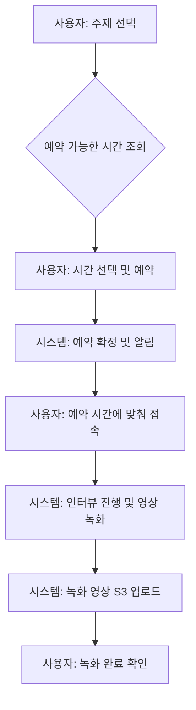

# 인터뷰 흐름 (Interview Flow)

> **설명**: 사용자가 인터뷰를 예약하고 진행하는 전체 과정을 설명합니다.

---

### 1. 흐름 다이어그램

### 2. 단계별 설명

- **주제 선택**: 사용자는 인터뷰하고 싶은 주제를 선택합니다.
- **시간 조회 및 예약**: 시스템에서 가능한 시간을 확인하고 원하는 시간을 선택하여 예약을 완료합니다.
- **인터뷰 진행**: 예약된 시간에 사용자가 시스템에 접속하면, 안내에 따라 인터뷰가 진행되고 영상이 자동으로 녹화됩니다.
- **영상 저장**: 인터뷰가 종료되면 녹화된 영상은 안전하게 AWS S3에 저장됩니다.

*(세부 정책 및 예외 처리 등 작성 필요)*
