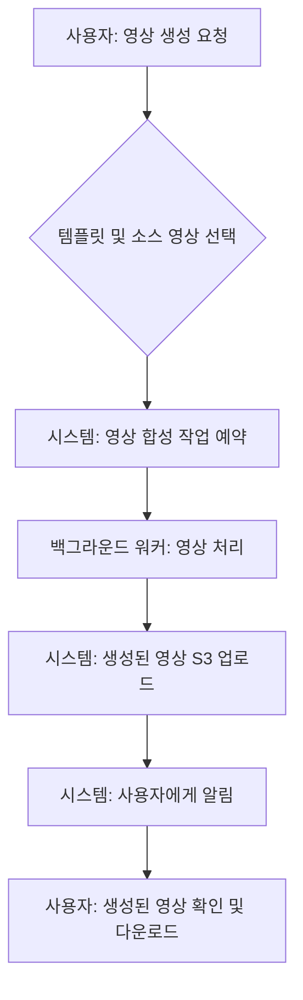

# 영상 생성 흐름 (Video Generation Flow)

> **설명**: 아카이빙된 인터뷰 영상을 기반으로 새로운 영상을 생성하는 과정을 설명합니다.

---

### 1. 흐름 다이어그램

### 2. 단계별 설명

- **영상 생성 요청**: 사용자는 아카이빙된 자신의 인터뷰 영상들을 조합하여 새로운 영상을 만들도록 요청합니다.
- **영상 처리**: 시스템은 백그라운드에서 영상 합성, 자막 추가, 배경 음악 삽입 등의 작업을 수행합니다.
- **결과 확인**: 영상 생성이 완료되면 사용자에게 알림이 가고, 사용자는 완성된 영상을 확인하고 다운로드할 수 있습니다.

*(세부 기술 스택 및 제약 조건 등 작성 필요)*
