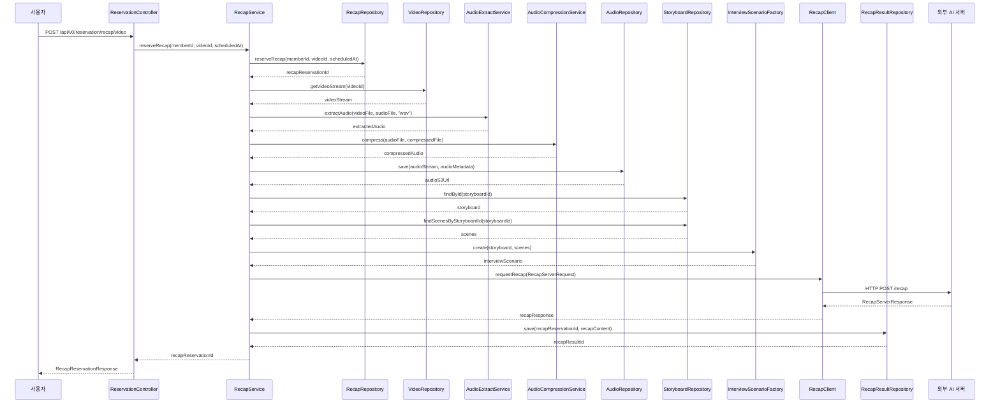

# 🎬 리캡 생성 플로우 (Recap Generation Flow)

이 문서는 orv-api-server의 핵심 기능 중 하나인 **리캡 생성 시스템**의 전체 흐름, 아키텍처, 그리고 기술적 구현 방식에 대해 상세히 설명합니다.

---

## 📋 개요

**리캡(Recap)**은 사용자가 녹화한 인터뷰 영상을 AI 서버로 전송하여 자동으로 요약 및 분석 결과를 생성하는 기능입니다. 이 시스템은 복잡한 미디어 처리 파이프라인과 외부 AI 서비스 연동을 통해 구현됩니다.

### 전체 흐름 요약
```
사용자 요청 → 예약 저장 → 오디오 처리 → 외부 AI 서버 호출 → 결과 저장 → 사용자에게 결과 제공
```

---

## 🏗️ 시스템 아키텍처

### 핵심 모듈 구조

#### 1. **API 계층**
- `ReservationController.java`: REST API 엔드포인트
- `POST /api/v0/reservation/recap/video`: 리캡 예약 생성
- `GET /api/v0/reservation/recap/{recapReservationId}/result`: 결과 조회

#### 2. **서비스 계층**
- `RecapService.java`: 비즈니스 로직 인터페이스
- `RecapServiceImpl.java`: 핵심 비즈니스 로직 구현

#### 3. **데이터 접근 계층**
- `RecapRepository.java`: 리캡 예약 데이터 접근
- `RecapResultRepository.java`: 리캡 결과 데이터 접근

#### 4. **외부 연동 계층**
- `RecapClient.java`: 외부 AI 서버 통신 인터페이스

#### 5. **미디어 처리 계층**
- `AudioExtractService`: 영상에서 오디오 추출
- `AudioCompressionService`: 오디오 압축 (Opus 포맷)
- `AudioRepository`: S3 오디오 파일 저장

---

## 🔄 상세 처리 흐름

### **1단계: API 요청 수신**

```java
@PostMapping("/recap/video")
public ApiResponse reserveRecap(@RequestBody RecapReservationRequest request)
```

**처리 내용:**
- JWT 토큰에서 `memberId` 추출
- 요청 데이터에서 `videoId`와 `scheduledAt` 추출
- `RecapService.reserveRecap()` 호출

**요청 예시:**
```json
{
  "videoId": "123e4567-e89b-12d3-a456-426614174000",
  "scheduledAt": "2025-01-18T10:00:00Z"
}
```

### **2단계: 예약 정보 DB 저장**

```java
// RecapServiceImpl.reserveRecap()
Optional<UUID> recapReservationIdOptional = recapRepository.reserveRecap(memberId, videoId, scheduledAt);
```

**처리 내용:**
- `recap_reservation` 테이블에 예약 정보 저장
- 고유한 `recapReservationId` 생성 및 반환
- 예약 생성 시점 기록

### **3단계: 오디오 처리 파이프라인**

이 단계가 가장 복잡하고 중요한 부분입니다:

#### **3-1. 비디오 스트림 다운로드**
```java
Optional<InputStream> videoStreamOptional = videoRepository.getVideoStream(video.getId());
Path tempVideoPath = Files.createTempFile("recap_video_", ".mp4");
Files.copy(videoInputStream, tempVideoPath);
```

#### **3-2. 오디오 추출 (Video → WAV)**
```java
Path tempAudioExtractedPath = Files.createTempFile("extracted_audio_", ".wav");
audioExtractService.extractAudio(tempVideoFile, tempAudioExtractedFile, "wav");
```

#### **3-3. 오디오 압축 (WAV → Opus)**
```java
Path tempAudioCompressedPath = Files.createTempFile("compressed_audio_", ".opus");
audioCompressionService.compress(tempAudioExtractedFile, tempAudioCompressedFile);
```

#### **3-4. S3 업로드**
```java
AudioMetadata audioMetadata = new AudioMetadata(
    video.getStoryboardId(),
    memberId,
    video.getTitle() + " (Recap Audio)",
    "audio/opus",
    video.getRunningTime(),
    compressedFile.length()
);
URI resourceUrl = audioRepository.save(compressedAudioInputStream, audioMetadata);
```

#### **3-5. 오디오 메타데이터 DB 저장**
```java
InterviewAudioRecording recapAudioRecording = InterviewAudioRecording.builder()
    .id(UUID.randomUUID())
    .storyboardId(video.getStoryboardId())
    .memberId(memberId)
    .audioUrl(resourceUrl.toString())
    .createdAt(OffsetDateTime.now(ZoneOffset.UTC))
    .runningTime(video.getRunningTime())
    .build();
interviewAudioRecordingRepository.save(recapAudioRecording);
```

### **4단계: 외부 AI 서버 호출**

```java
callRecapServer(recapReservationId, video, audioS3Url);
```

**처리 내용:**

1. **스토리보드 정보 조회**: 해당 영상의 스토리보드와 씬 정보 가져오기
2. **InterviewScenario 생성**: 질문-답변 시나리오 구성
3. **API 요청 생성**: `RecapServerRequest` 객체 생성
4. **외부 서비스 호출**: `RecapClient.requestRecap()` 호출
5. **결과 저장**: 응답 결과를 `RecapResultRepository`에 저장

```java
// 스토리보드 정보 조회
Storyboard storyboard = storyboardRepository.findById(video.getStoryboardId())
    .orElseThrow(() -> new RuntimeException("Storyboard not found"));

List<Scene> allScenes = storyboardRepository.findScenesByStoryboardId(video.getStoryboardId())
    .orElseThrow(() -> new RuntimeException("Scenes not found"));

// InterviewScenario 생성
InterviewScenario interviewScenario = interviewScenarioFactory.create(storyboard, allScenes);

// API 요청 생성 및 호출
RecapServerRequest requestBody = new RecapServerRequest(audioS3Url, interviewScenario);
recapClient.requestRecap(requestBody).ifPresent(response -> {
    recapResultRepository.save(recapReservationId, response.getRecapContent());
});
```

### **5단계: 결과 조회**

```java
@GetMapping("/recap/{recapReservationId}/result")
public ApiResponse getRecapResult(@PathVariable UUID recapReservationId)
```

**처리 내용:**
- `recapReservationId`로 완료된 리캡 결과 조회
- 씬별 질문-답변 요약 정보 반환

**응답 예시:**
```json
{
  "recapResultId": "456e7890-f12b-34c5-d678-901234567890",
  "createdAt": "2025-01-18T10:15:00Z",
  "answerSummaries": [
    {
      "sceneId": "789e0123-a45b-67c8-d901-234567890123",
      "question": "자기소개를 부탁드립니다.",
      "answerSummary": "10년 경력의 소프트웨어 개발자로 주로 백엔드 개발을 담당하고 있습니다."
    }
  ]
}
```

---

## 🎨 데이터 흐름 다이어그램



---

## 🔧 기술적 특징

### **1. 임시 파일 관리**
- 모든 미디어 처리 과정에서 임시 파일 생성
- `try-finally` 블록으로 안전한 파일 정리 보장
- 메모리 효율성 고려

```java
try {
    // 임시 파일 생성 및 처리
    tempVideoPath = Files.createTempFile("recap_video_", ".mp4");
    // ... 처리 로직
} finally {
    // 안전한 파일 정리
    if (tempVideoFile != null && tempVideoFile.exists()) {
        Files.deleteIfExists(tempVideoPath);
    }
}
```

### **2. 오디오 포맷 최적화**
- **입력**: MP4 비디오 파일
- **중간**: WAV 오디오 파일 (무손실 추출)
- **출력**: Opus 오디오 파일 (고효율 압축)

### **3. 에러 핸들링**
- 각 단계별 상세한 로깅
- 예외 발생 시 적절한 에러 메시지 반환
- 리소스 정리 보장

### **4. 데이터 무결성**
- `recap_reservation` ↔ `interview_audio_recording` 연결
- `recap_reservation` ↔ `recap_result` 연결
- 외래키 관계를 통한 데이터 일관성 보장

---

## 🛡️ 보안 및 안정성

### **1. 인증 및 권한**
- JWT 토큰 기반 사용자 인증
- 사용자별 리소스 접근 제어

### **2. 파일 처리 보안**
- 임시 파일의 안전한 생성 및 정리
- S3 저장 시 적절한 권한 설정

### **3. 외부 서비스 연동**
- 외부 AI 서버 호출 시 적절한 타임아웃 설정
- 실패 시 재시도 로직 (필요시)

---

## 🚀 성능 최적화

### **1. 비동기 처리**
- 현재는 동기적 처리이지만, 향후 비동기 처리 고려 가능
- 사용자에게는 즉시 예약 ID 반환

### **2. 파일 압축**
- Opus 코덱을 사용한 고효율 오디오 압축
- 네트워크 전송 시간 단축

### **3. 스토리지 최적화**
- S3를 통한 확장 가능한 파일 저장
- 메타데이터 분리를 통한 효율적 검색

---

## 🔮 확장 가능성

### **1. 배치 처리**
- 다수의 영상 일괄 처리
- 스케줄링 기능 활용

### **2. 실시간 처리**
- 스트리밍 중 실시간 분석
- WebSocket을 통한 실시간 결과 전송

### **3. 다중 AI 서비스**
- 여러 AI 서비스 연동
- 결과 비교 및 통합

---

## 📊 모니터링 포인트

### **1. 성능 지표**
- 영상 처리 시간
- 오디오 추출 시간
- 외부 서비스 응답 시간

### **2. 에러 모니터링**
- 파일 처리 실패율
- 외부 서비스 호출 실패율
- 임시 파일 정리 실패

### **3. 리소스 사용량**
- 임시 파일 사용량
- 메모리 사용량
- S3 저장 용량

---

## 🎯 결론

리캡 생성 시스템은 복잡한 미디어 처리 파이프라인과 외부 AI 서비스 연동을 매우 체계적으로 구현한 시스템입니다. 모듈화된 설계, 안정적인 에러 처리, 그리고 확장 가능한 아키텍처를 통해 높은 품질의 서비스를 제공할 수 있는 기반을 마련했습니다.

특히 임시 파일 관리, 오디오 포맷 최적화, 그리고 데이터 무결성 보장 등의 기술적 구현이 매우 인상적이며, 향후 다양한 확장 기능을 추가할 수 있는 유연성을 제공합니다.
